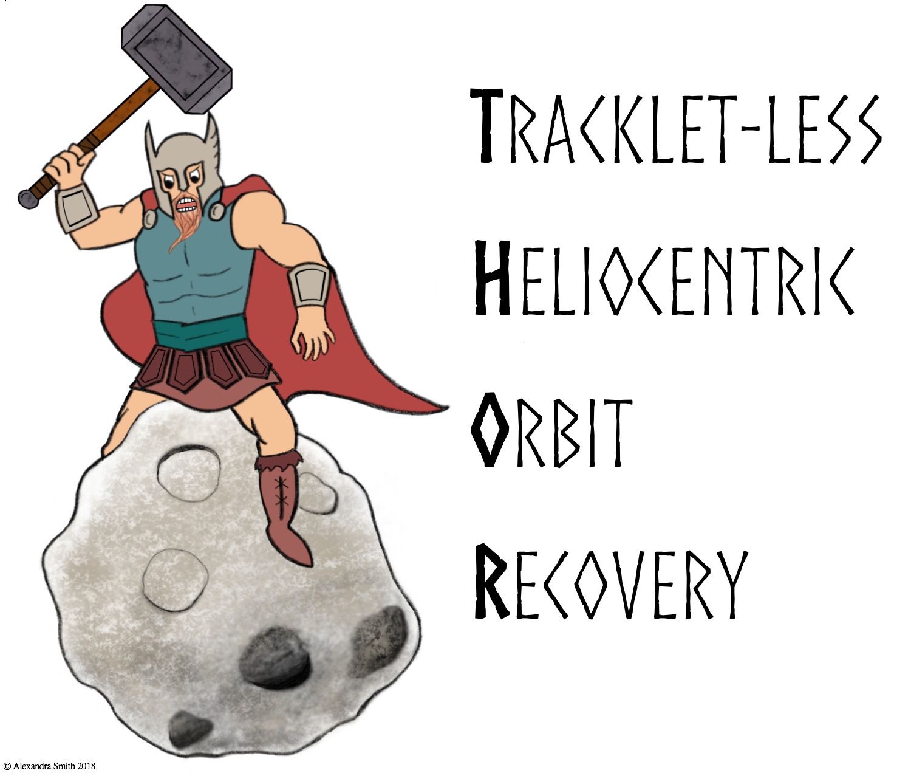

# THOR
Tracklet-less Heliocentric Orbit Recovery  

[](https://img.shields.io/badge/Python-3.9%2B-blue)
[](https://opensource.org/licenses/BSD-3-Clause)
[](https://zenodo.org/badge/latestdoi/116747066)  
[](https://github.com/moeyensj/thor/actions/workflows/docker-build-lint-test.yml)
[](https://github.com/moeyensj/thor/actions/workflows/conda-build-lint-test.yml)
[](https://github.com/moeyensj/thor/actions/workflows/pip-build-lint-test-coverage.yml)  
[](https://github.com/pre-commit/pre-commit)
[](https://coveralls.io/github/moeyensj/thor?branch=main)
[](https://hub.docker.com/r/moeyensj/thor)  
[](https://anaconda.org/moeyensj/thor)
[](https://anaconda.org/moeyensj/thor)
[](https://anaconda.org/moeyensj/thor)


**Warning: THOR is still in very active development.**

The latest "stable" version is [v1.2](https://github.com/moeyensj/thor/releases/tag/v1.2). The code on the main branch is currently being used to develop THOR v2.0 and is not guaranteed to be stable. We anticipate that v2.0 will be the one most useful to the community and we aim for it to be released by the end of 2023. THOR v2.0 is a complete re-write of the THOR code primarily designed to enable it for use as a service on the [Asteroid, Discovery, Analysis and Mapping (ADAM) platform](https://b612.ai/). The primary goal of v2.0 is to enable THOR to work at scale on many small cloud-hosted VMs. The secondary goal of v2.0 is to add changes that will work towards enabling the linking of NEOs (THOR is currently configured to work on the Main Belt and outwards).  


## Installation

The corresponding notebook repository can be found at: https://github.com/moeyensj/thor_notebooks

The following installation paths are available:  
[Anaconda](#Anaconda)  
[Docker](#Docker)  
[Source](#Source)  

### Anaconda
`thor` can be downloaded directly from anaconda:  
```conda install -c moeyensj thor```

Or, if preferred, installed into its own environment via:  
```conda create -n thor_py38 -c moeyensj thor python=3.8```

### Docker

A Docker container with the latest version of the code can be pulled using:  

```docker pull moeyensj/thor:latest```

To run the container:  

```docker run -it moeyensj/thor:latest```

The THOR code is installed the /projects directory, and is by default also installed in the container's Python installation.
To access the code in Python:
```
(base) root@202110177eee:/# python
Python 3.6.9 |Anaconda, Inc.| (default, Jul 30 2019, 19:07:31)
[GCC 7.3.0] on linux
Type "help", "copyright", "credits" or "license" for more information.
>>> import thor
>>>
```

### Source
Clone this repository using either `ssh` or `https`. Once cloned and downloaded, `cd` into the repository.

To install THOR in its own `conda` enviroment please do the following:  

```conda create -n thor_py38 -c defaults -c conda-forge -c astropy -c moeyensj --file requirements.txt python=3.8```  

Or, to install THOR in a pre-existing `conda` environment called `env`:  

```conda activate env```  
```conda install -c defaults -c conda-forge -c astropy -c moeyensj --file requirements.txt```  

Once pre-requisites have been installed using either one of the options above, then:  

```python setup.py install```

Or, if you are actively planning to develop or contribute to THOR, then:

```python setup.py develop --no-deps```

You should now be able to start Python and import THOR.
```
┌─(thor_py38)[moeyensj][±][main ✓][~/projects/thor]
└─▪ python
Python 3.8.8 (default, Apr 13 2021, 19:58:26)
[GCC 7.3.0] :: Anaconda, Inc. on linux
Type "help", "copyright", "credits" or "license" for more information.
>>> import thor
>>>
```

**If you would like to run Jupyter Notebook or Juptyter Lab with THOR please see the installation instructions in the THOR notebooks repository.**

## Working directory layout (checkpointing + recursive test-orbit splitting)

THOR’s `link_test_orbit(...)` and `link_test_orbits(...)` can optionally persist
stage outputs and checkpoint state to a `working_dir`. Checkpointing is **file
based**: on restart, THOR chooses the next stage by checking which stage output
files already exist on disk.

### Where files go

For a single orbit, define:

- **`orbit_id`**: the test orbit’s id (`TestOrbits.orbit_id`)
- **`working_dir`**: the directory you pass to THOR

THOR writes:

- **Config**: `<working_dir>/inputs/config.json`
- **Test orbit definition**: `<working_dir>/inputs/<orbit_id>/test_orbit.parquet`
- **Stage outputs** (per-orbit): stored under an “orbit directory” which depends on `use_orbit_subdir`:
  - If `use_orbit_subdir=True` (default): `<working_dir>/<orbit_id>/`
  - If `use_orbit_subdir=False`: `<working_dir>/`

Stage output files (created as stages complete):

- `filtered_observations.parquet`
- `test_orbit_ephemeris.parquet`
- `transformed_detections.parquet`
- `clusters.parquet`
- `cluster_members.parquet`
- `iod_orbits.parquet`
- `iod_orbit_members.parquet`
- `od_orbits.parquet`
- `od_orbit_members.parquet`
- `recovered_orbits.parquet`
- `recovered_orbit_members.parquet`

### Recursive splitting (“recursive test orbits”)

When using `link_test_orbits(...)`, THOR can **split** a test orbit into child
test orbits after `filter_observations` when:

- `config.split_threshold` is set, and
- the filtered observation count exceeds it, and
- `current_depth < config.split_max_depth`.

Child test-orbit ids are deterministic: they are generated by appending a
zero-padded suffix to the parent id (e.g. `<parent_orbit_id>_000`, `_001`, …).

To make recursion resumable with file-based checkpointing, THOR persists the
chosen children under the parent orbit directory:

- `split_test_orbits.parquet` (present iff the orbit split)

Children are then processed under subdirectories of the parent orbit directory.

### Example tree (one split level)

Below is the theoretical layout for a parent orbit that splits once. (Not all
stage files will exist at the same time; presence indicates completion.)

```
<orbit_dir>/                                   # see "Where files go" above
  inputs/
    config.json
    <orbit_id>/test_orbit.parquet
    <orbit_id>_000/test_orbit.parquet
    <orbit_id>_001/test_orbit.parquet

  filtered_observations.parquet
  test_orbit_ephemeris.parquet
  transformed_detections.parquet
  clusters.parquet
  cluster_members.parquet
  iod_orbits.parquet
  iod_orbit_members.parquet
  od_orbits.parquet
  od_orbit_members.parquet
  recovered_orbits.parquet
  recovered_orbit_members.parquet

  split_test_orbits.parquet                    # only if the orbit split

  <orbit_id>_000/
    ... same stage output files for the child ...

  <orbit_id>_001/
    ... same stage output files for the child ...
```

