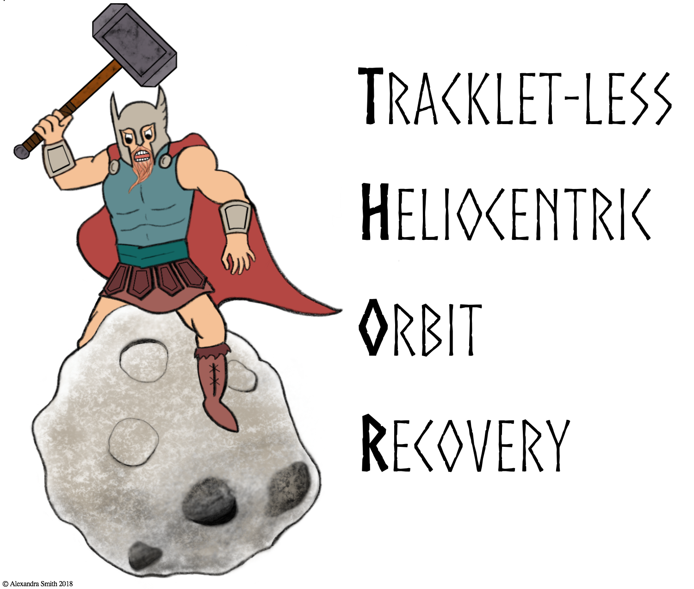

# THOR
Tracklet-less Heliocentric Orbit Recovery

[](https://www.travis-ci.com/moeyensj/thor)
[](https://coveralls.io/github/moeyensj/thor)
[](https://opensource.org/licenses/BSD-3-Clause)

## Installation
To install pre-requisite software using anaconda: 

```conda install -c defaults -c conda-forge --file requirements.txt```

To install pre-requisite software using pip:

```pip install -r requirements.txt```

Once pre-requisites have been installed:

```python setup.py install```

## Testing Installation

Using pytest (with coveralls):

```pytest thor --cov=thor```

Or using setuptools:

```python setup.py test```
