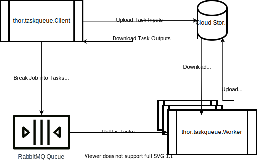
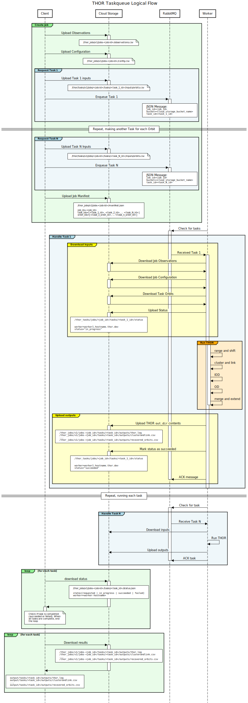

# THOR Taskqueue #

The `thor.taskqueue` package provides facilities for running THOR in parallel
through the use of a _task queue_. This document explains the design and
architecture of that system.

## High-level design ##

The general idea is that one program (called the "**Client**") makes a request
(called a **Job**) for THOR to be executed on some data. It splits this request
into pieces called **Tasks**, and uploads the data to a Google Cloud **Storage
Bucket**.

For each Task, the Client puts a message into a RabbitMQ **Queue**.

Meanwhile, a bunch of **Worker** processes (which could be running anywhere)
which are pre-configured to listen to the same Queue. They check for work to be
done - and whenever they find work in the Queue, they download the input data
from the Storage Bucket, run THOR on it, and upload results back to the Storage
bucket.

Here's the same idea in a diagram:

## Sequence diagram

Here's a sequence diagram which describes the flow in much more detail:

## Bucket objects

The following objects are stored in the Storage Bucket:

### Inputs

Observations and configuration are shared across all tasks, so they are uploaded
just once into `thor_jobs/v1/job-{job-id}/inputs`. The test orbits, on the other
hand, are per-task, so they are uploaded into
`thor_jobs/v1/job-{job-id}/tasks/task-{task-id}/inputs`.

Preprocessed observations are stored in
`thor_jobs/v1/job-{job-id}/inputs/observations.csv`. They are stored as a
dataframe, serialized with `to_csv`.

The THOR Configuration (that is, a thor.config.Configuration object, serialized
into YAML) is stored in `thor_jobs/v1/job-{job-id}/inputs/config.yml`.

The Orbits (that is, a `thor.orbits.Orbits` object, serialized with `to_csv`) is
stored in `thor_jobs/v1/job-{job-id}/tasks/task-{task-id}/inputs/orbits.csv`.

### Metadata

The Client produces a Manifest listing all the tasks that form a job, as well as
the identifiers for orbits in each task. This can help with human readability of
tools, since Task IDs are random strings. This manifest is stored in
`thor_jobs/v1/job-{job-id}/manifest.json`.

The Worker processes report on their status via little JSON objects stored in
the bucket. Each Worker reports its status at
`thor_jobs/v1/job-{job-id}/tasks/task-{task-id}/status`. The Task status file is
JSON-encoded, and has two keys. "state" indicates the current state of the task
("requested", "in_progress", "succeeded", or "failed"), and "worker" indicates
the identity (currently the hostname) of the worker handling the task.

### Outputs

When a Worker gets a task, it runs `thor.main.runTHOROrbit` on the inputs after
downloading them. When that function returns, it uploads all the results to
`thor_jobs/v1/job-{job-id}/tasks/task-{task-id}/outputs`.

The results include all the intermediate files that are produced by
`runTHOROrbit`, like CSVs that checkpoint the computation as it goes. It also
inclues a log file of the run at `thor.log`.

If `runTHOROrbit` exited normally, then the `status` is updated to have a
`"state"` of `"succeeded"`, and the Worker goes back to checking for tasks to
do.

If `runTHOROrbit` exited because of any Exception, then the `status` is updated
to have a `"state"` of `"failed"`. The outputs are still uploaded. A traceback
of the exception is also uploaded to
`thor_jobs/v1/job-{job-id}/tasks/task-{task-id}/outputs/error_message.txt`.
